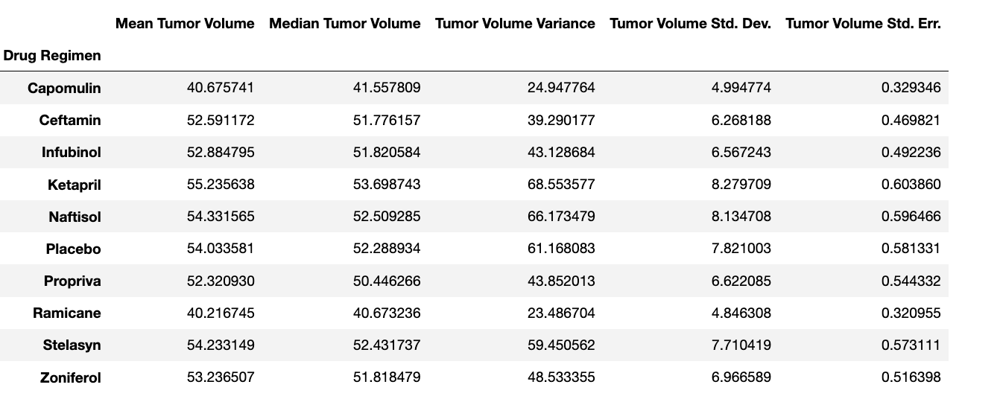
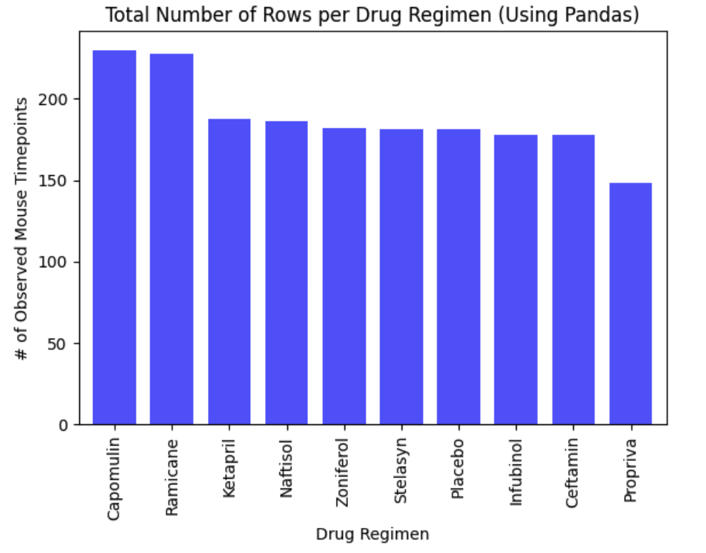
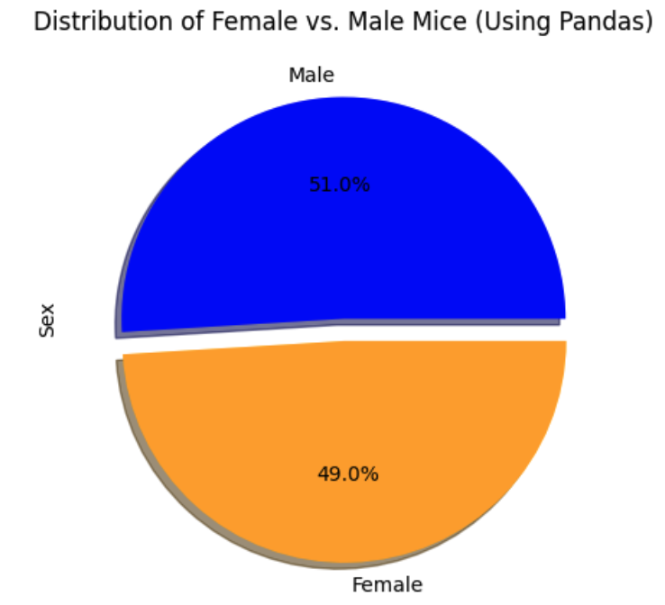
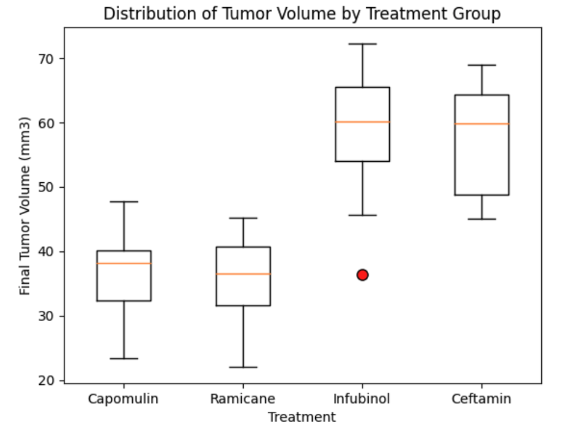

# Module 5 Challenge

## Table of Contents

- [About](#about)
- [Getting Started](#getting_started)
- [Installing](#installing)
- [Analysis](#analysis)
- [Result Screenshots](#result_screenshots)
- [References](#references)

## About
Welcome to the Pymaceuticals, Inc. Anti-Cancer Medic project! This README provides an overview of the project, including its background, objectives, and tasks. As a senior data analyst at Pymaceuticals, Inc., you have been entrusted with the task of analyzing and summarizing the results of an animal study conducted to evaluate the effectiveness of various drug regimens in treating squamous cell carcinoma (SCC), a form of skin cancer. This README will guide you through the project's key components and steps.

#### Instructions
##### This assignment is broken down into the following tasks:
- Prepare the data.
- Generate summary statistics.
- Create bar charts and pie charts.
- Calculate quartiles, find outliers, and create a box plot.
- Create a line plot and a scatter plot.
- Calculate correlation and regression.

## Getting started

### Prerequisites
Before you begin, ensure you have the following installed:
- Python 3.x
- Jupyter Notebook
- Required Python packages (NumPy, Pandas, Matplotlib, SciPy)

## Installing

Install the necessary packages and download the module files. You can find the data files and code in the Module 5 Challenge files folder.

## Analysis

- Ramicane and Capomulin demonstrate superior efficacy in reducing tumor volume compared to other drug regimens, as evidenced by their significantly lower mean and median tumor volumes, as shown in the summary statistics table.

- Capomulin and Ramicane stand out with the highest number of observed mouse timepoints, each exceeding 200 observations. Propriva, with approximately 150 observations, is the only exception, while the remaining drug regimens exhibit relatively consistent data with around 175 observations each.

- The distribution of female vs. male mice is nearly even, with a minimal 2% difference between the two genders.

- The only potential outlier among the drug regimens is Infubinol, with a value of 36.321346.

- Box Plot Interpretation:

    - Capomulin and Ramicane both display similar median tumor volumes, which are notably lower when compared to Infubinol and Ceftamin.
    - Infubinol is highlighted as it contains a potential outlier, as previously identified.
    - Ceftamin exhibits a broader distribution of final tumor volumes compared to the other treatments.
    - Capomulin and Ramicane boast narrower distributions, suggesting potentially more consistent treatment effects.
    
- The line plot depicts the tumor volume response of Mouse ID l509 to Capomulin treatment. Initially, from Day 0 to Day 20, there is observable tumor growth, indicating that Capomulin did not immediately reduce tumor size. However, post-Day 20, a consistent decline in tumor volume is evident, indicating the treatment's effectiveness in reducing tumor size.

- Weight vs. Tumor Volume Trend: There appears to be a negative correlation between mouse weight and average tumor volume. In other words, as mouse weight increases, average tumor volume tends to decrease. This suggests a potential relationship between weight and the effectiveness of Capomulin treatment in reducing tumor size.

## Result Screenshots

*Caption: Statistical Summary.*

*Caption: Total Number of Rows per Drug Regimen.*

*Caption: Distribution of Female vs. Male Mice.*

*Caption: Distribution of Tumor Volume by Treatment Group.*

## References
[Matplotlib Box Plot Documentation](https://matplotlib.org/stable/gallery/statistics/boxplot_demo.html).
